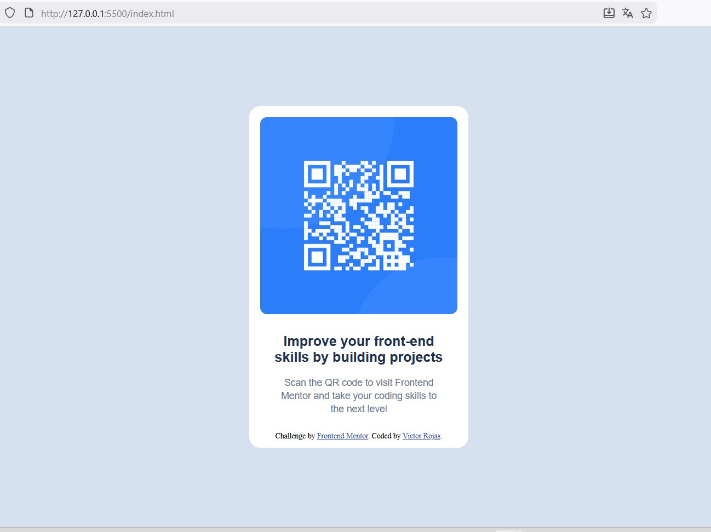

# Frontend Mentor - QR code component solution

This is a solution to the [QR code component challenge on Frontend Mentor](https://www.frontendmentor.io/challenges/qr-code-component-iux_sIO_H). Frontend Mentor challenges help you improve your coding skills by building realistic projects.

## Table of contents

- [Overview](#overview)
  - [Screenshot](#screenshot)
  - [Links](#links)
- [My process](#my-process)
  - [Built with](#built-with)
  - [What I learned](#what-i-learned)
  - [Continued development](#continued-development)
  - [Useful resources](#useful-resources)
  - [AI Collaboration](#ai-collaboration)
- [Author](#author)
- [Acknowledgments](#acknowledgments)

## Overview

### Screenshot



### Links

- Solution URL: (git@github.com:VicRojas8084/qr-code-component.git)
- Live Site URL: (https://vicrojas8084.github.io/qr-code-component/)

## My process

### Built with

- Semantic HTML5 markup
- CSS custom properties
- Flexbox
- Desktop-first workflow

### What I learned

html code, shows how write a unique instruction idea divided in 3 lines., see below:

```html
<div class="main__instructions">
  <p>
    Scan the QR code to visit Frontend <br />Mentor and take your coding skills
    to <br />the next level
  </p>
</div>
```

Using display: flex; and flex-direction: column;, is the best way to right place our whole design, see below:

```css
.content {
  background-color: #fff;
  border-radius: 16px;

  display: flex;
  flex-direction: column;
  align-items: center;
  gap: 24px;

  width: 320px;
  height: 499px;
  padding: 16px;
}
```

### Continued development

This simply project could be done using grid css, however the best way for this was flexbox.

I hope I could use css grid in the next projects. I consider that is a good tool to develop almost any kind of land pages.
Another area that I want to focus on in future projects is the best understanding and driving of borders and shadows. Using this, is to forward to a next high level creating land pages with a great design.

I think it is necessary to practice as much as possible with responsive. Today, more than 75% of web page wiews must be done through smart phones... so...

### Useful resources

- [MDN Web Docs](https://developer.mozilla.org/es/) - This helped me to find explanation or remember me how to use certain commands. I really liked this pattern and will use it going forward.

### AI Collaboration

AI that I've used is ChatGPT in 2 versions:

Normal version (ask chat) --> I make a question about a command or instruction I don't remember at the moment or some cases for doing something special or unknown for me. I do my prompt being the most descriptive than I can (answer way to chatGPT dependes its response detailed).

Canvas version (help to code) --> I use canvas mode when I have some code and I want to chatGPT review/test it.

## Author

- Frontend Mentor - [@VicRojas8084](https://www.frontendmentor.io/profile/VicRojas8084)

## Acknowledgments

Thanks to Frontend Mentor to share this learning site for all people interested in improvement WebDev skills.

Best Regards
Vic
